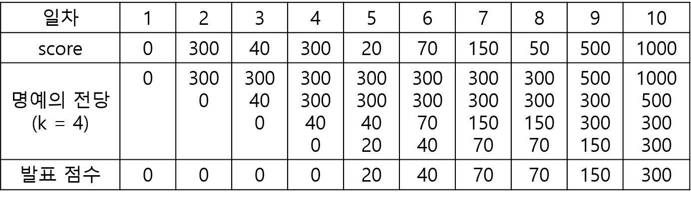

# 명예의 전당

### [문제링크](https://school.programmers.co.kr/learn/courses/30/lessons/138477)

### 성능요약

메모리: 79.4MB, 시간: 2.32ms

### 문제설명
"명예의 전당"이라는 TV 프로그램에서는 매일 1명의 가수가 노래를 부르고, 시청자들의 문자 투표수로 가수에게 점수를 부여합니다. 매일 출연한 가수의 점수가 지금까지 출연 가수들의 점수 중 상위 k번째 이내이면 해당 가수의 점수를 명예의 전당이라는 목록에 올려 기념합니다. 즉 프로그램 시작 이후 초기에 k일까지는 모든 출연 가수의 점수가 명예의 전당에 오르게 됩니다. k일 다음부터는 출연 가수의 점수가 기존의 명예의 전당 목록의 k번째 순위의 가수 점수보다 더 높으면, 출연 가수의 점수가 명예의 전당에 오르게 되고 기존의 k번째 순위의 점수는 명예의 전당에서 내려오게 됩니다.

이 프로그램에서는 매일 "명예의 전당"의 최하위 점수를 발표합니다. 예를 들어, k = 3이고, 7일 동안 진행된 가수의 점수가 [10, 100, 20, 150, 1, 100, 200]이라면, 명예의 전당에서 발표된 점수는 아래의 그림과 같이 [10, 10, 10, 20, 20, 100, 100]입니다.

명예의 전당 목록의 점수의 개수 k, 1일부터 마지막 날까지 출연한 가수들의 점수인 score가 주어졌을 때, 매일 발표된 명예의 전당의 최하위 점수를 return하는 solution 함수를 완성해주세요.

### 제한조건
- 3 ≤ k ≤ 100
- 7 ≤ score의 길이 ≤ 1,000
  - 0 ≤ score[i] ≤ 2,000

### 입출력 예
|k|	score|	result|
|-|-|-|
|3|	[10, 100, 20, 150, 1, 100, 200]|	[10, 10, 10, 20, 20, 100, 100]|
|4|	[0, 300, 40, 300, 20, 70, 150, 50, 500, 1000]|	[0, 0, 0, 0, 20, 40, 70, 70, 150, 300]|

### 입출력 예 설명
입출력 예 #1

문제의 예시와 같습니다.

입출력 예 #2

아래와 같이, [0, 0, 0, 0, 20, 40, 70, 70, 150, 300]을 return합니다.

### :star: 문제 핵심
- 일자별 점수가 명예의 전당에 올라가며 k번까지만 내림차순으로 정렬되어 올라갑니다.
- 하지만 발표점수는 명예의 전당 중 최하위 점수를 발표하기 때문에 값을 넣을 때는 오름차순으로 정렬하여 넣어야 합니다.
- 오름차순 정렬도 되며 맨 앞의 값부터 꺼낼 수 있는 ***PriorityQueue(우선순위 큐)***를 사용하여 문제를 풀어냈습니다.
- PriorityQueue은 값을 저장하면서 오름차순으로 정렬합니다.
- 따라서 맨 앞은 최하위 값부터 시작을 하게되는데 queue의 peek() 메소드를 통해 최하위 값을 answer에 담아줍니다.
- peek()를 하게되면 queue에서 빠져나가므로 그 다음 최하위값을 peek로 꺼낼 수 있게 됩니다.
- 명예의 전당은 k번째 까지만 출력을 허용하니 queue의 사이즈가 k번 이상일 때는 뒤에있는 숫자를 꺼낼 수 있도록 pop()을 합니다.
- 이를 반복하여 문제를 해결합니다.