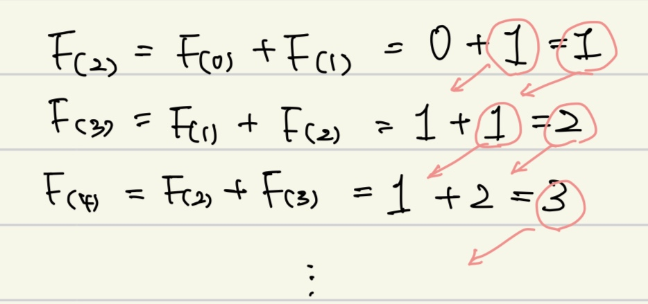

# 피보나치 수

### [문제링크](https://school.programmers.co.kr/learn/courses/30/lessons/12945)

### 성능요약

메모리: 75.7MB, 시간: 3.49ms

### 문제설명
피보나치 수는 F(0) = 0, F(1) = 1일 때, 1 이상의 n에 대하여 F(n) = F(n-1) + F(n-2) 가 적용되는 수 입니다.

예를들어

- F(2) = F(0) + F(1) = 0 + 1 = 1
- F(3) = F(1) + F(2) = 1 + 1 = 2
- F(4) = F(2) + F(3) = 1 + 2 = 3
- F(5) = F(3) + F(4) = 2 + 3 = 5

와 같이 이어집니다.

2 이상의 n이 입력되었을 때, n번째 피보나치 수를 1234567으로 나눈 나머지를 리턴하는 함수, solution을 완성해 주세요.

### 제한조건
- n은 2 이상 100,000 이하인 자연수입니다.

### 입출력 예
|n|	return|
|-|-|
|3	|2|
|5	|5|

### 입출력 예 설명
피보나치수는 0번째부터 0,1,1,2,3,5,... 와 같이 이어집니다.

### :star: 문제 핵심
- 문제를 보면 규칙성이 보인다.

- 

- 다음과 같은 규칙성 대로 풀이를 이어나가게 되면 코드와 같이 된다.
- 그 다음 나온 피보나치 수를 1234567로 나눴을때의 결과값을 출력하는 것이다.
- 그리고 n 번째가 1234567로 나눈 나머지를 리턴하도록 하였기 때문에 answer %= 1234567을 하였다.
- answer가 1234567보다 작을때는 나머지가 answer 그대로 출력이 되며, 넘을 경우에만 나머지를 반환하게 된다.